# Morgan Webb - T2A2 - ImpulseAuction

Link to deployed application: https://pure-citadel-44141.herokuapp.com/

Link to github repository: https://github.com/morganw-code/ImpulseAuction

##### Stack

        - Front-end : HTML5, SCSS, ERB, BOOTSTRAP4, JQUERY, JAVASCRIPT
        - Back-end : RAILS, PUMA
        - Utilities : DEVISE, AWS-S3, STRIPE, RUFUS-SCHEDULER, ULTRAHOOK, MONEY
        - DevOps : GIT, GITHUB, LUCID CHART, TRELLO
        - Deployment : HEROKU

##### Sitemap

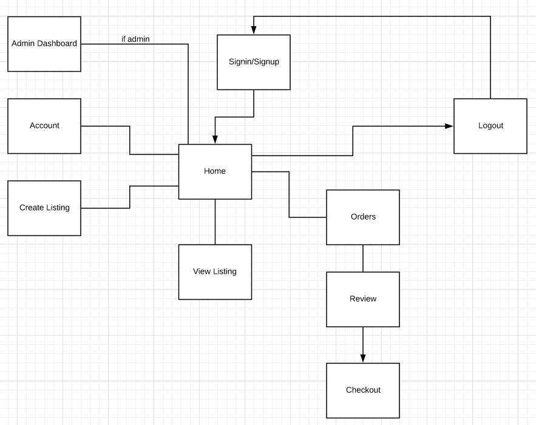

##### 1. Explain the different high-level components (abstractions) in your App.

ImpulseAuction is a two-sided 60-second aution marketplace built using Ruby on Rails.

###### Database

ImpulseAuction uses a RDBMS (Relational Database Management System) called PostgreSQL. The database is responsible for storing information such as user information, listing information, etc.

###### User Authentication

User authentication is handled by the Device gem. When a user visits the site, before they can view anything, they must create an account or authenticate themselves with an existing account, granting them access to anything a user may do within the application. The devise gem is used to authenticate these users, and their sessions. Only registered users are allowed to create a listing, view listings, and place a bid on a listing. The administration dashboard is only accessible by administrators.

###### Listing Creation

Users can create a listing specifying a title, description, a starting price (which will scale with bids), a product image and if the listing should relist or not if the listing failed to sell.

###### Scheduler Task

Every second a task is executed, this task is responsible for checking the database for any updates at any given time and throughout various conditional statements, each listing is updated, and orders are created accordingly. This task resides in `config/initializers/scheduler.rb`. When certain actions are made, they affect the state of the listing. If a listing is set to relist and the listing has not sold, the listing will relist with a new life-time of 60-seconds. This process is repeated until a listing has been sold or cancelled by the user.

###### Automatic Reloading

Similar to the scheduled task, a JavaScript function gets called every second to reload each of the containers that contain listings in three different states:

        0 - Ended

        1 - Active

        2 - Ending

If a listing is in it's active or ending state, it is displayed at the bottom of the screen. If a listing has a bid that belongs to a user that is currently signed in, the listing will also display in the "Live Bids" section for that user. And finally, if a listing has been sold to a user and has ended, the listing will appear at the top of the page under the "Sold" section.

###### Money

The money gem is used to convert listing prices to Australian rates. The prices stored in the listings table is stored in cents, so the gem converts it to dollars.

###### Ultrahook

Ultrahook is used to expose an endpoint in local environment, so that stripe can communicate with the application during development in a local environment.

##### 2. List and describe any 3rd party services.

These are the following 3rd party services ImpulseAuction uses to function.

###### Amazon S3

Amazon S3 is used to store profile and listing images. ImpulseAuction utilises Amazon S3 as a cloud-based storage solution.

###### Devise

The Devise authentication gem is used to authenticate users and grant them access to areas of the website or certain actions like creating a listing, placing bids, etc. Users can create an account providing their necessary credentials.

###### Bootstrap

Twitter's bootstrap front-end CSS framework is used to style various pages.

###### Faker

Faker is used for seeding the database with fake data during development. It is responsible for creating fake data like listing titles, descriptions, etc.

##### Stripe

Stripe is used to provide a secure and reliable payment method for buyers and sellers so that they can trust that their information is secure. Stripe is a popular payment gateway similar to PayPal.

##### 3.1. Identify the problem you’re trying to solve by building this particular marketplace App?

ImpulseAuction provides a quick and easy solution to buying online where you only have to wait 60 seconds for the outcome of a certain aution! Users do not need to worry about making a payment during the last 60 seconds, once they have won the auction, they may make a payment when it suits them. ImpulseAuction puts the buyer in control, where they are always guaranteed to pay the price that the auction ended with.

##### 3.2 Why is the problem identified a problem that needs solving?

ImpulseAuction provides a platform where buyers and sellers can quickly make purchases or sell a listing in less than 60-seconds. This provides a quick and easy way of shopping/selling online without having to wait days or weeks for the outcome of other auctions online.

##### Screenshots

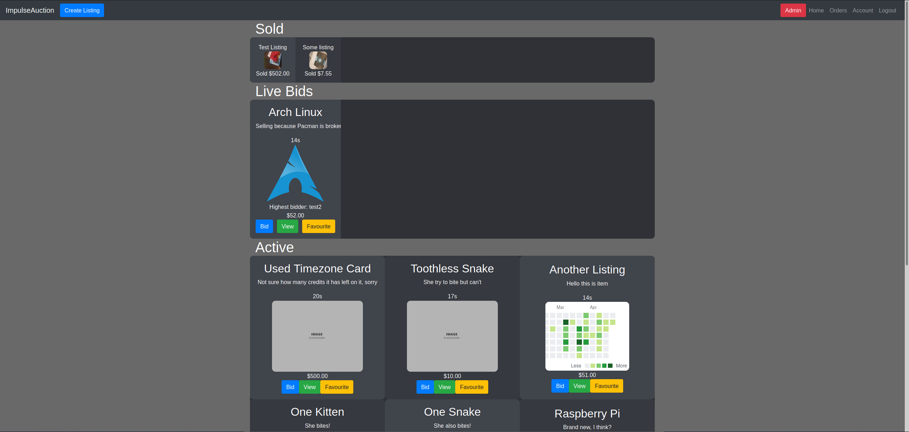

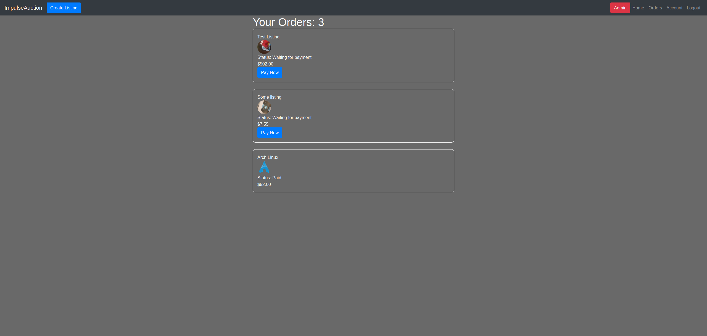

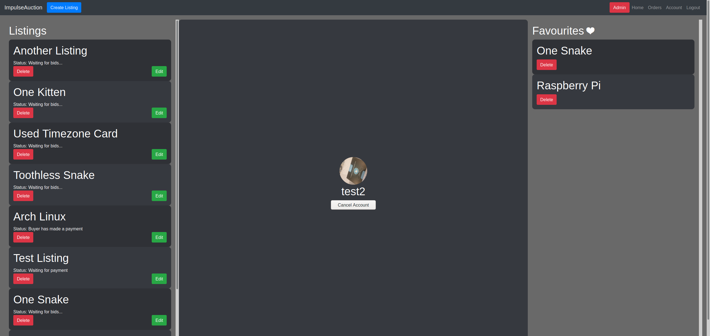

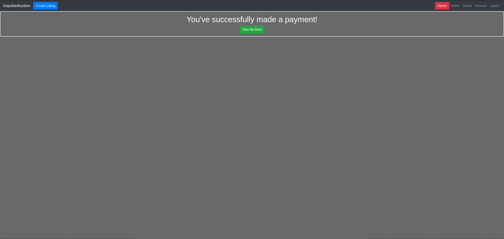

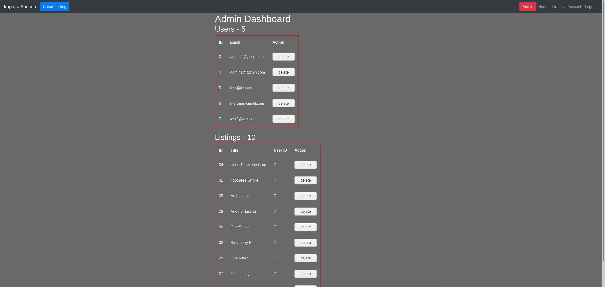

##### 4. Describe your project’s models in terms of the relationships (active record associations) they have with each other.

A user has_many listings, and a listing belongs_to a user

A user has_hany bids, and a bid belongs_to a user and a listing

A user has_one_attached image

A user has_many favourites, and a favourite belongs to a user and a listing

A user has_many orders, and an order belongs to a user and a listing

A order belongs_to a listing and a user

A favourite belongs_to a user and a listing

A bid belongs_to a user and a listing

A listing belongs_to a user, and a user belongs to a listing

A listing has_one_attached image

A listing has_many bids

A listing has_many favourites

A listing has_many orders

```
        class Bid < ApplicationRecord
                belongs_to :user
                belongs_to :listing
        end

        class Favourite < ApplicationRecord
                belongs_to :user
                belongs_to :listing
                validates_uniqueness_of :user, :scope => :listing
        end

        class Listing < ApplicationRecord
                belongs_to :user
                has_one_attached :image
                has_many :bids, :dependent => :destroy
                has_many :favourites, :dependent => :destroy
                has_many :orders, :dependent => :destroy
                validates :title, :description, :starting_price, :image, :relist, presence: true
        end

        class Order < ApplicationRecord
                belongs_to :listing
                belongs_to :user, :foreign_key => :user_id, class_name: "User"
        end

        class User < ApplicationRecord
                # Include default devise modules. Others available are:
                # :confirmable, :lockable, :timeoutable, :trackable and :omniauthable
                devise :database_authenticatable, :registerable,
                        :recoverable, :rememberable, :validatable
                has_many :listings, dependent: :destroy
                has_many :bids, :dependent => :destroy
                has_one_attached :image
                has_many :favourites, :dependent => :destroy
                has_many :orders, :foreign_key => :user_id, :dependent => :destroy
        end
```

##### 5. Discuss the database relations to be implemented.

ImpulseAuction has the following relations implemented

###### Users

The User table has many relations that belong to it, each user has zero or many listings, zero or many favourites, and a relation to active_storage_attachments. The relation to the Users table is stored in a foreign key for in related tables.

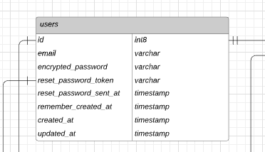

###### Listings

A listing belongs to a user, and the user_id foreign key for the User tabe is stored upon listing creation.

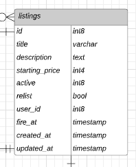

###### Favourites

The favourites table is a join table that contains a two foreign keys, a user_id, and a listing_id. These id's are used to keep track of what listing the user favourited and which user favourited that specific listing.

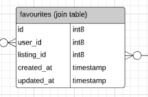

###### Orders

Similar to favourites, an order contains two foreign keys to track which listing the order was for and what user placed said order.

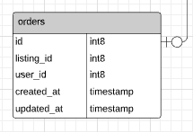

###### Bids

The bids table holds a foreign key to the users table and the listings table. This is to keep track of who created the bid and what listing it was for. The amount is also tracked in this table, which updates the total on the starting_price for the listing internally. A bid belongs_to a user and a listing.

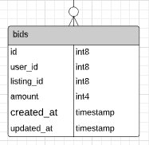

##### 6. Provide your database schema design.

###### Users

        id: int8
        email: varchar
        encrypted_password: varchar
        reset_password_token: varchar
        reset_password_sent_at: timestamp
        remember_created_at: timestamp
        created_at: timestamp
        updated_at: timestamp
        admin: boolean

###### Listings

        id: int8
        title: varchar
        description: text
        starting_price: int4
        sold: boolean
        relist: boolean
        user_id: int8
        fire_at: timestamp
        created_at: timestamp
        updated_at: timestamp

###### Bids

        id: int8
        user_id: int8
        listing_id: int8
        amount: int4
        created_at: timestamp
        updated_at: timestamp

###### Favourites

        id: int8
        user_id: int8
        listing_id: int8
        created_at: timestamp
        updated_at: timestamp

###### Orders

        id: int8
        user_id: int8
        listing_id: int8
        paid: boolean
        created_at: timestamp
        updated_at: timestamp

##### 7. Provide User stories for your App.

ImpulseAuction functions in a way that users have the ability to buy and sell with a normal registered account.

###### Admin

        - As an administrator, I want to be able to delete users
        - As an administrator, I want to be able to delete listings

###### User

        - As a registered user, I want to be able to view listings
        - As a registered user, I want to be able to create listings
        - As a registered user, I want to be able to bid on listings
        - As a registered user, I want to be able to pay when I want to
        - As a registered user, I want to be able to favourite listings
        - As a registered user, I do not want to be able to see the admin dashboard
        - As a registered user, I do not want unregistered users to see my account
        - As a registered user, I want to navigate the site freely
        - As a registered user, I want to be able to delete listings from a dashboard
        - As a registered user, I want to be able to edit listings from a dashboard
        - As a registered user, I want to be able to delete favourites from a dashboard

##### 8. Provide Wireframes for your App.

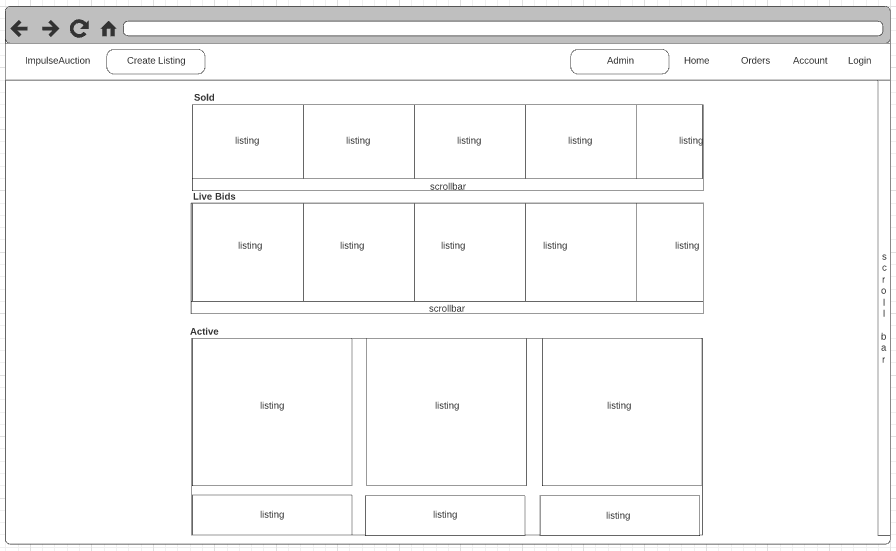

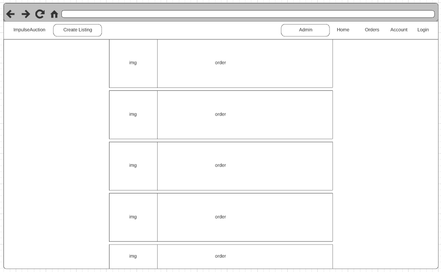

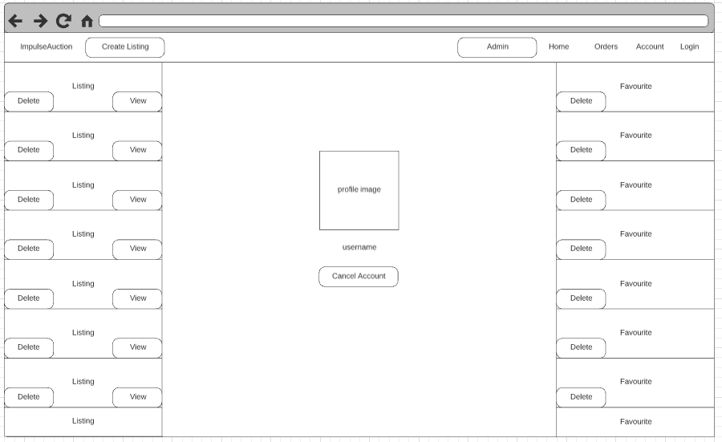

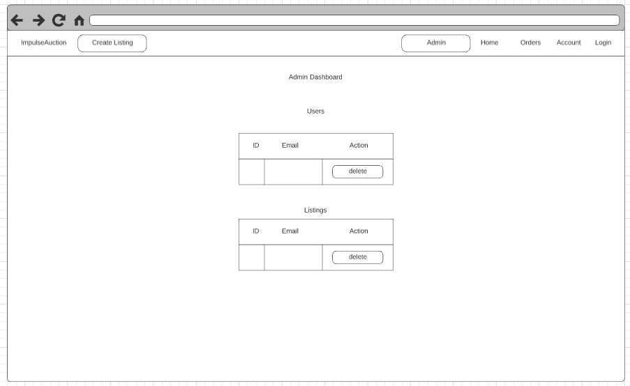

##### 9. Describe the way tasks are planned and tracked in your project.

Development was tracked and planned using Trello, here are some of the screenshots.

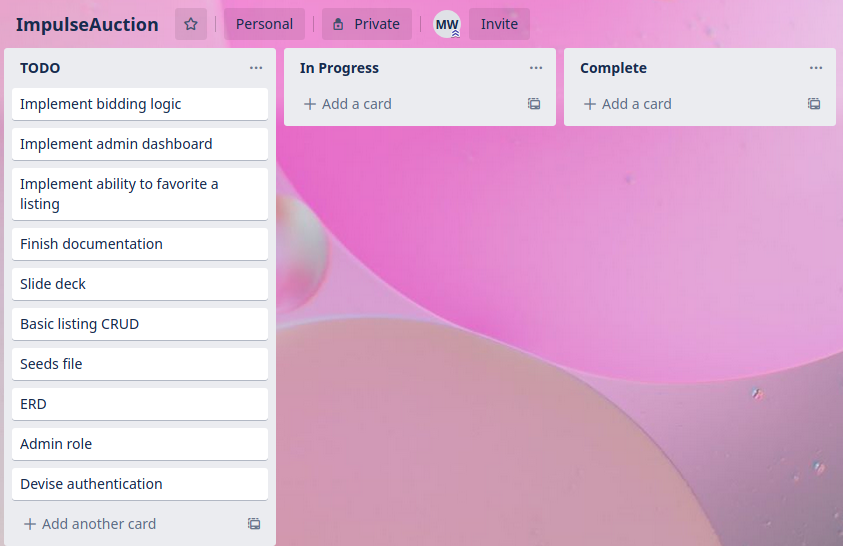

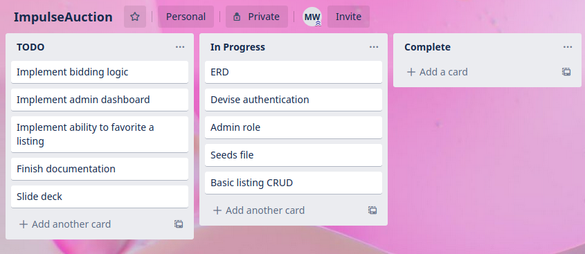

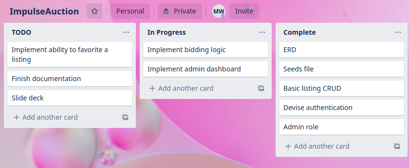

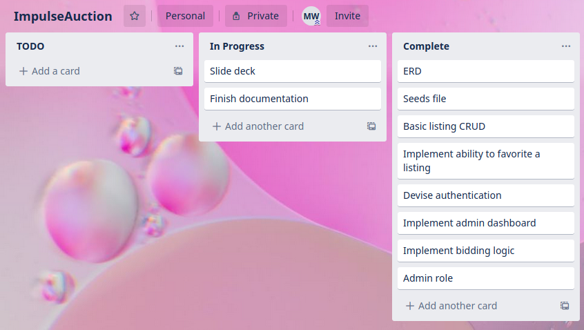

##### 10. ERD provided represents a normalised database model.

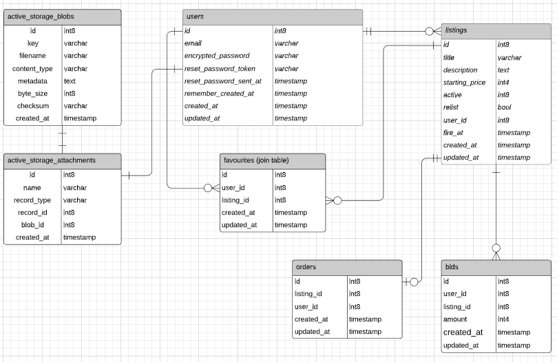